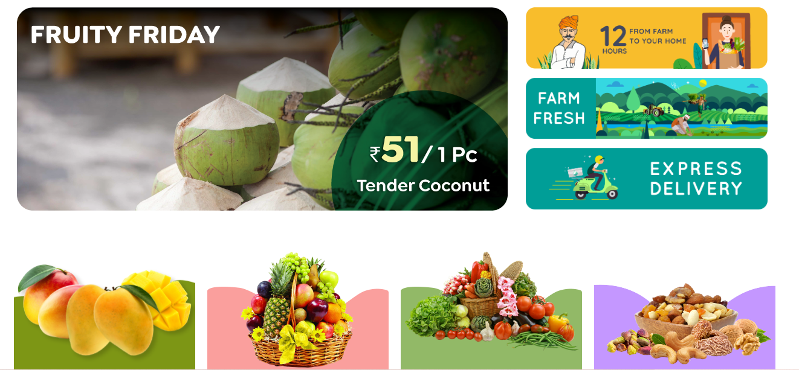
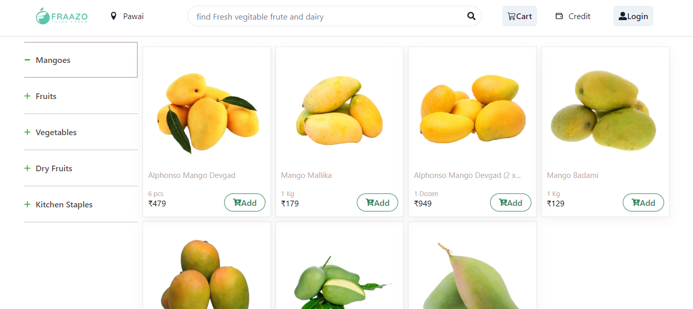
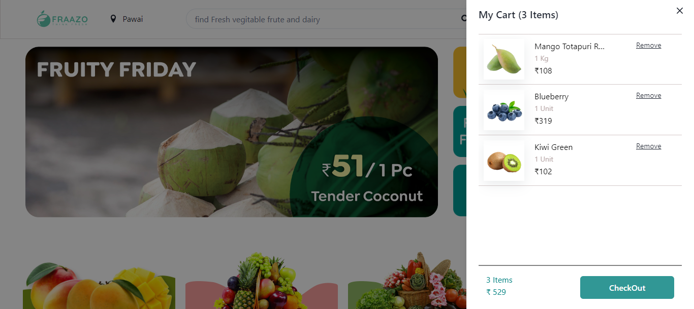
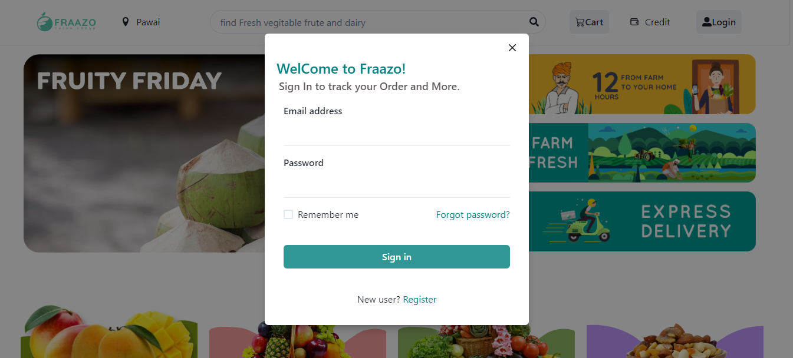
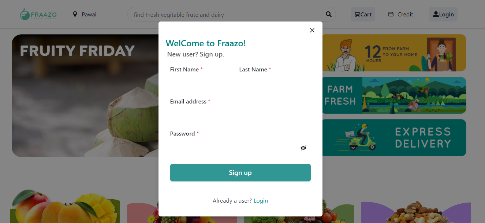
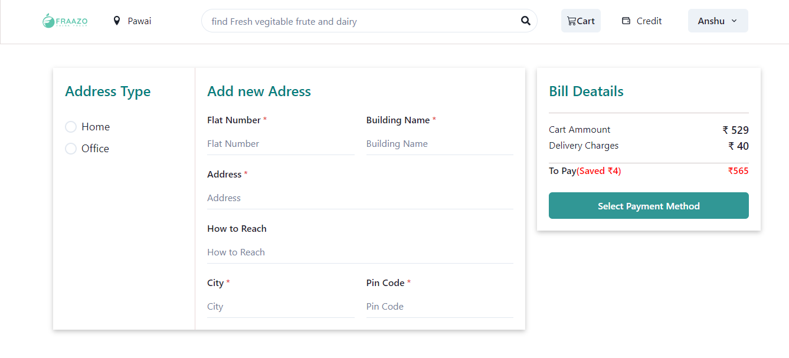
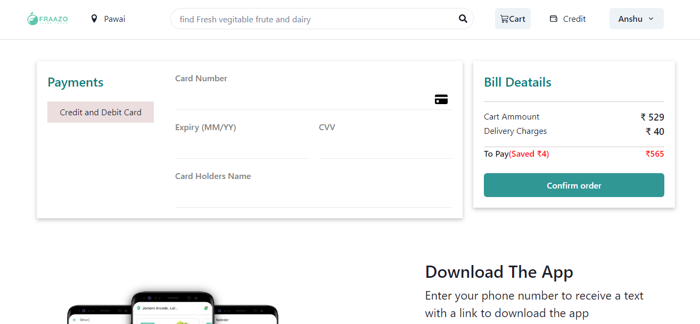

<h2>Welcome to this repo</h2>
I had completed the task in 5 days and Given my best efforts to Construct this project.
In case of any suggestion and query feel free to connect me

 <h1>About </h1>
Fraazo is one of India’s largest quick commerce start-ups on a mission to provide every Indian household farm-fresh fruits and vegetables daily, ordered from the convenience of their homes. Fraazo is the first company in India to establish the concept of dark stores in the fruits and vegetable segment.
 
 
 <h1>TOOLS AND TECHNOLOGY USED ></h1>
  <li>HTML (through React)</li>
  <li>css</li>
<li>javascript</li>  
<li>React</li>
<li>Nodejs</li>
<li>mongodb atlas (for database)</li>
 <li>React</li>
 <li>Redux</li>
 <li>Node.js</li>

 
 
  <h1>Node packages and libraries ></h1>
 <li>cors : 2.8.5</li>
 <li>express : 4.17.1</li>
 <li>mongoose : 6.0.8</li>
<li>nodemon : 2.0.13</li>
<li>jsonwebtoken</li>
 <li>react : 17.0.2</li>
 <li>react-dom : 17.0.2</li>
 <li>react-router-dom : 5.3.0</li>
  <li>Chakra UI</li>
 <li>react-Redux</li>
  <li>react-multi-carousel</li>
   <li>redux-thunk</li>
   <li>axios</li>
   
 

 

### Project Description

_To start with the Project run the following command in terminal in "backend" folder_

> > ⌘ **npm start**

> After that 

> _go to the "frontend" folder and run the following command in terminal_
 
> > ⌘ **npm start**

>   and than you can explore our project.

_Or you can directly explore our project through this link_
 
 
 ### _Following are the Screenshots for the reference_

- **Landing Page**
  

- **Product Page**

  

- **Cart-Page**

  
  
- **Sign-In Page**

  
  
- **Sign-up Page**

  

- **Checkout Page**

  
  

- **Payment Page**

  

---

### About Project

> I did this project within 5 days in our unit-5 construct week. I worked on backend & frontend parts with includes various types of libraries into it and I have also added database for our project so user and product details will be saved and can be used accordingly. I have also add some cool functionality in our product page where you can filter and sort the product according to your choice and user can Signup and Login to buy the products.

---

### Netlify Link

https://fraazo-masai.netlify.app/
 ------
 <h1>WEBSITE USER FLOW ></h1>
 ----
the user flow that we tried to maintain is,

home -> login/signup -> dashboard -> get started to products -> create user Id-> Enter email details -> choose products -> Product detail page-> -> Products Check out page ->payment status -> order placed -> track status.
 
----
 
---

---
